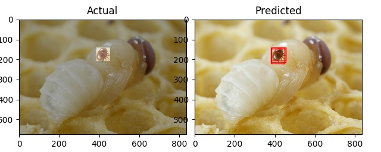

# varroa_mite_detector
# ITML7.110 - Varroa destructor object detection application




##Introduction

The parasitic mite Varroa destructor is the greatest single driver of the global honey bee health decline. Better understanding of the association of this parasite and its host is critical to developing sustainable management practices.

### Varroa mite locations


The following infographic illustrates an interesting 


###  considerations


[Source](https://www.pnas.org/content/116/5/1792)

##Project objectives and development processes:
**Project objectives**
- Identify and localize 4 classes of objects in images and video
    - Queen bee
    - Worker bee
    - Drone bee
    - Varroa mite
- Discuss ways which the AI application could be used to quantify the infection of a bee colony with varroa mite.
- Discuss ways aspects about the implimentation which could be bottlenecking performance
- Discuss ways which could significantly improved model performance 

**Rough plan for going about creating the application:**

1. Collect data required for training using GoogleImageDownload
2. Label the different data types
3. Create a function to store the data into HDF5 format using h5py
4. Create a function to load that data from HDF5 format into the program and split it into training and test data sets
5. Create a sequential neural network for the data to pass through.
6. Initially create a simple DNN for image classification with emphasis on the data storage format
7. Bring in CNN concepts to achieve object detection.

**Potential candidates for object detection model**

- Yolov3
- SSD mobilenet
- SSD inceptionv3
- Faster RCNN
- Resnet Faster RCNN

**Final project dependancies**
- Tensorflow (1.14.0)
- Keras
- OpenCV
- H5PY
- Matplotlib pyplot
- Mask-RCNN
- Numpy
- LabelImage
- GoogleImagesDownload


**File directory structure**
```markdown
├── build
│   └── lib
│       └── mrcnn
│           ├── config.py
│           ├── __init__.py
│           ├── model.py
│           ├── parallel_model.py
│           ├── utils.py
│           └── visualize.py
├── classes
│   ├── drone
│   │   ├── annots
│   │   │   ├── 1.xml
│   │   │   ├── ....xml
│   │   │   └── 150.xml
│   │   └── images
│   │       ├── 1.jpg
│   │       ├── ....jpg
│   │       └── 150.jpg
│   ├── queen
│   │   ├── annots
│   │   │   ├── 1.xml
│   │   │   ├── ....xml
│   │   │   └── 150.xml
│   │   └── images
│   │       ├── 1.jpg
│   │       ├── ....jpg
│   │       └── 150.jpg
│   ├── varroa
│   │   ├── annots
│   │   │   ├── 1.xml
│   │   │   ├── ....xml
│   │   │   └── 150.xml
│   │   └── images
│   │       ├── 1.jpg
│   │       ├── ....jpg
│   │       └── 150.jpg
│   └── worker
│   │   ├── annots
│   │   │   ├── 1.xml
│   │   │   ├── ....xml
│   │   │   └── 150.xml
│   │   └── images
│   │       ├── 1.jpg
│   │       ├── ....jpg
│   │       └── 150.jpg
├── dist
│   └── mask_rcnn-2.1-py3.5.egg
├── LICENSE
├── MANIFEST.in
├── mask_rcnn.egg-info
│   ├── dependency_links.txt
│   ├── PKG-INFO
│   ├── SOURCES.txt
│   └── top_level.txt
├── mrcnn
│   ├── config.py
│   ├── __init__.py
│   ├── model.py
│   ├── parallel_model.py
│   ├── __pycache__
│   │   ├── config.cpython-36.pyc
│   │   ├── __init__.cpython-36.pyc
│   │   ├── model.cpython-36.pyc
│   │   └── utils.cpython-36.pyc
│   ├── utils.py
│   └── visualize.py
├── README.md
├── requirements.txt
├── setup.cfg
├── setup.py
└── working_directory
    ├── error-train-output.txt
    ├── evaluate.py
    ├── full_test.py
    ├── mask_rcnn_coco.h5
    ├── parse_xml.py
    ├── predict.py
    ├── prepare_db.py
    ├── queen_cfg20191029T0955
    │   ├── events.out.tfevents.1572296135.mpgz390
    │   ├── mask_rcnn_queen_cfg_0001.h5
    │   ├── mask_rcnn_queen_cfg_0002.h5
    │   ├── mask_rcnn_queen_cfg_0003.h5
    │   ├── mask_rcnn_queen_cfg_0004.h5
    │   ├── mask_rcnn_queen_cfg_0005.h5
    │   ├── mask_rcnn_queen_cfg_0006.h5
    │   ├── mask_rcnn_queen_cfg_0007.h5
    │   ├── mask_rcnn_queen_cfg_0008.h5
    │   ├── mask_rcnn_queen_cfg_0009.h5
    │   ├── mask_rcnn_queen_cfg_0010.h5
    │   ├── mask_rcnn_queen_cfg_0011.h5
    │   └── mask_rcnn_queen_cfg_0012.h5
    ├── server.go
    ├── sort.py
    ├── test_object.py
    └── train.py


```
###Theory


### Training


```

Epoch 1/10
120/120 [==============================] - 88s 730ms/step - loss: 2.7087 - val_loss: 3.2434
Epoch 2/10
120/120 [==============================] - 76s 636ms/step - loss: 1.6939 - val_loss: 2.2237
Epoch 3/10
120/120 [==============================] - 76s 636ms/step - loss: 1.7381 - val_loss: 3.1923
Epoch 4/10
120/120 [==============================] - 76s 636ms/step - loss: 1.1044 - val_loss: 1.7972
Epoch 5/10
120/120 [==============================] - 77s 639ms/step - loss: 0.9983 - val_loss: 2.6869
Epoch 6/10
120/120 [==============================] - 77s 641ms/step - loss: 1.2234 - val_loss: 1.7024
Epoch 7/10
120/120 [==============================] - 77s 642ms/step - loss: 1.0364 - val_loss: 1.4967
Epoch 8/10
120/120 [==============================] - 77s 643ms/step - loss: 1.1683 - val_loss: 0.9847
Epoch 9/10
120/120 [==============================] - 77s 638ms/step - loss: 0.8885 - val_loss: 0.8264
Epoch 10/10
120/120 [==============================] - 76s 635ms/step - loss: 0.9023 - val_loss: 0.9118
```

```
120/120 [==============================] - 87s 729ms/step - loss: 1.2035 - val_loss: 0.9630
Epoch 2/12
120/120 [==============================] - 76s 637ms/step - loss: 0.5723 - val_loss: 3.4859
Epoch 3/12
120/120 [==============================] - 76s 637ms/step - loss: 0.6128 - val_loss: 1.0282
Epoch 4/12
120/120 [==============================] - 77s 645ms/step - loss: 0.6680 - val_loss: 1.1278
Epoch 5/12
120/120 [==============================] - 77s 642ms/step - loss: 0.5968 - val_loss: 1.1915
Epoch 6/12
120/120 [==============================] - 76s 633ms/step - loss: 0.4546 - val_loss: 0.7645
Epoch 7/12
120/120 [==============================] - 76s 634ms/step - loss: 0.4923 - val_loss: 0.6541
Epoch 8/12
120/120 [==============================] - 76s 635ms/step - loss: 0.4572 - val_loss: 0.8129
Epoch 9/12
120/120 [==============================] - 76s 637ms/step - loss: 0.4680 - val_loss: 2.5687
Epoch 10/12
120/120 [==============================] - 76s 634ms/step - loss: 0.4252 - val_loss: 1.3153
Epoch 11/12
120/120 [==============================] - 76s 632ms/step - loss: 0.3496 - val_loss: 1.5521
Epoch 12/12
120/120 [==============================] - 76s 633ms/step - loss: 0.3209 - val_loss: 2.6558

```


###Resources:

##### Image collection

[Google image download automation tool](https://github.com/hardikvasa/google-images-download)

##### Tensorflow basics

[Using the SavedModel format](https://www.tensorflow.org/guide/saved_model)

[Save and load models](https://www.tensorflow.org/tutorials/keras/save_and_load)

[Transfer learning with TF image classification](https://www.tensorflow.org/tutorials/images/transfer_learning)

##### Keras info

[Sequential model guide](https://keras.io/getting-started/sequential-model-guide/)

[Choosing an optimizer for training](https://www.dlology.com/blog/quick-notes-on-how-to-choose-optimizer-in-keras/)

##### Tensorflow GPU memory management

[How to set allow GPU mem growth - TF 1.14.0](https://github.com/keras-team/keras/issues/11584)

[TensorFlow’s “Its Complicated” Relationship with GPU Memory](https://medium.com/@auro_227/tensorflows-its-complicated-relationship-with-gpu-memory-5672745df84)

##### Data processing

[h5py data prep](http://machinelearninguru.com/deep_learning/data_preparation/hdf5/hdf5.html)

[TFRecord data prep](http://machinelearninguru.com/deep_learning/data_preparation/tfrecord/tfrecord.html)

[Quick start for using HDF5 with Python](https://h5py.readthedocs.io/en/stable/quick.html)

[Image annotation tool](https://github.com/tzutalin/labelImg)

##### Object detection model development

- [Mask-RCNN Tutorial](https://machinelearningmastery.com/how-to-train-an-object-detection-model-with-keras/)

- [Food Detector - Mask-RCNN multiclass example](https://github.com/CrookedNoob/Mask_RCNN-Multi-Class-Detection/blob/master/food.py)

- [Understanding Mask-RCNN](https://medium.com/@alittlepain833/simple-understanding-of-mask-rcnn-134b5b330e95)

- [Mask-RCNN Repo](https://github.com/matterport/Mask_RCNN)

[Tensorflow detection model zoo](https://github.com/tensorflow/models/blob/master/research/object_detection/g3doc/detection_model_zoo.md)

[Gentle guide to object detection](https://www.pyimagesearch.com/2018/05/14/a-gentle-guide-to-deep-learning-object-detection/)

[Pretrained model with transfer learning tutorial](https://towardsdatascience.com/custom-object-detection-using-tensorflow-from-scratch-e61da2e10087)

[SSD Object detection with TF Tutorial](https://lambdalabs.com/blog/how-to-implement-ssd-object-detection-in-tensorflow/)

[OpenCV Basic Object Detection Tutorial](https://www.pyimagesearch.com/2019/05/13/object-detection-and-image-classification-with-google-coral-usb-accelerator)

[Yolo Object Detection Tutorial](https://www.pyimagesearch.com/2018/11/12/yolo-object-detection-with-opencv)

[Yolov3 in Keras](https://machinelearningmastery.com/how-to-perform-object-detection-with-yolov3-in-keras/)

##### Research papers

[TF Object detection API](https://ai.googleblog.com/2017/06/supercharge-your-computer-vision-models.html)

[Mask-RCNN Paper](https://arxiv.org/abs/1703.06870)

[Object recognition](http://www.joig.org/uploadfile/2018/0717/20180717055805469.pdf)

[Industry information on conventional varroa mite detection and control methods](https://www2.gov.bc.ca/assets/gov/farming-natural-resources-and-industry/agriculture-and-seafood/animal-and-crops/animal-production/bee-assets/api_fs222.pdf)

[Varroa destructor feeding method study](https://www.pnas.org/content/116/5/1792)
