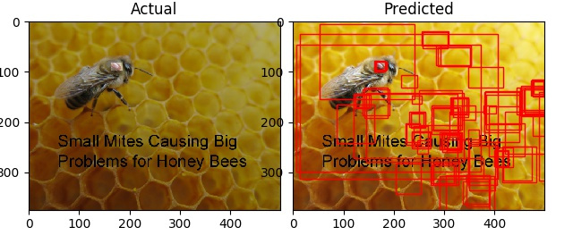

# Varroa Mite Object-Detection Application


##### Installation
Ubuntu 18.04 is recommended.
Install [Python3 virtual environments](https://gist.github.com/frfahim/73c0fad6350332cef7a653bcd762f08d) before starting installation.

If using a GPU:
1. Ensure relevant Nvidia drivers are installed.
2. Update requirements.txt to "tensorflow-gpu==1.14.0"
3. Make sure to allow GPU memory growth in code (see "GPU Issues")

Copy and paste the following into a bash script file:
```bash
#!/usr/bin/env bash
cd ~
python3 -m venv vmd_venv_v1
which python3
source ~/vmd_venv_v1/bin/activate
git clone https://github.com/dynafa/varroa_mite_detector
cd varroa_mite_detector
wget https://dynafa.com/static/resources/classes.tar.gz
tar -xzvf classes.tar.gz
rm classes.tar.gz
sudo python3 setup.py install
pip3 install --upgrade pip
pip3 install requirements.txt
echo "Project Python3 envidronment setup finished"
```
Script to download image tools for building custom dataset (See "Collecting and annotating data")
```
#!/usr/bin/env bash
cd ~
git clone https://github.com/hardikvasa/google-images-download
cd google-images-download
sudo python3 setup.py install
cd ~
git clone https://github.com/tzutalin/labelImg
cd labelImg
sudo python3 setup.py install
```
Then execute bash scripts to install
```bash
$ bash <path>/scriptname.sh
or
$ cd <path>
$ sudo chmod +x scriptname.sh
$ ./scriptname.sh
```
Finally, execute python scripts to train, evaluate and predict.
```bash
$ source ~/vmd_venv_v1/bin/activate
$ cd varroa_mite-detector/Working_directory
$ python3 train.py
$ python3 evaluate.py
$ python3 predict.py
```

References used are all linked at the bottom for tutorials on TF/Keras and how to retrain object detection models.  

### Introduction

The parasitic mite Varroa destructor is the greatest single driver of the global honey bee health decline. Better understanding of the association of this parasite and its host is critical to developing sustainable management practices.
In this project, I looked at whether existing computer vision models can be used to accurately detect the varroa mite on bees. This is a challenging task, as the complexity of the environment and the location in which the varroa mite is commonly found is particularly high. Even in the case where a network can be successfully converged, extracting the right data from the bees without disturbing their activities is still going to be a significant challenge.


##### Varroa mite locations


Electron microscope photography shows that varroa mite can actually slide between the segments of the bee's body to feed.


Preferred feeding location probabilities of varroa on an abult bee. 

The following infographic illustrates an interesting fact about the nature of the varroa mite and their interaction with their hosts, which is they are more likely to be present on the underside of the bee that on the bee's posterior side. Research in the field confirms the reasons why this is, " For five decades, we have believed that these mites consume hemolymph like a tick consumes blood, and that Varroa cause harm primarily by vectoring viruses. Our work shows that they cause damage more directly. Varroa externally digest and consume fat body tissue rather than blood." [Source](https://www.pnas.org/content/116/5/1792)

### Project objectives and development processes:
**Project objectives**
- Identify and localize 4 classes of objects in images of bees
    - Queen bee
    - Worker bee
    - Drone bee
    - Varroa mite
- Discuss ways aspects about the implimentation which could be bottlenecking performance
- Discuss ways which could significantly improved model performance 

**Rough plan for going about creating the application:**

1. Collect data required for training using GoogleImageDownload
2. Label the different data types
3. Create a function to store the data into HDF5 format using h5py 
4. Create a function to load that data from HDF5 format into the program and split it into training and test data sets
5. Create a sequential neural network for the data to pass through.
6. Initially create a simple DNN for image classification with emphasis on the data storage format - see https://github.com/dynafa/keras_examples
7. Bring in CNN concepts to achieve object detection.

**Potential candidates for object detection model**

- Yolov3
- SSD mobilenet
- SSD inceptionv3
- Faster RCNN
- Resnet Faster RCNN
- Etc.

**Final project dependancies**
- Tensorflow (1.14.0)
- Keras
- OpenCV
- H5PY
- Matplotlib pyplot
- Mask-RCNN
- Numpy
- LabelImage
- GoogleImagesDownload


**File directory structure**

The following describes the file directory struture of the project.

```markdown
├── build
│   └── lib
│       └── mrcnn
│           ├── config.py
│           ├── __init__.py
│           ├── model.py
│           ├── parallel_model.py
│           ├── utils.py
│           └── visualize.py
├── classes
│   ├── drone
│   │   ├── annots
│   │   │   ├── 1.xml
│   │   │   ├── ....xml
│   │   │   └── 150.xml
│   │   └── images
│   │       ├── 1.jpg
│   │       ├── ....jpg
│   │       └── 150.jpg
│   ├── queen
│   │   ├── annots
│   │   │   ├── 1.xml
│   │   │   ├── ....xml
│   │   │   └── 150.xml
│   │   └── images
│   │       ├── 1.jpg
│   │       ├── ....jpg
│   │       └── 150.jpg
│   ├── varroa
│   │   ├── annots
│   │   │   ├── 1.xml
│   │   │   ├── ....xml
│   │   │   └── 150.xml
│   │   └── images
│   │       ├── 1.jpg
│   │       ├── ....jpg
│   │       └── 150.jpg
│   └── worker
│   │   ├── annots
│   │   │   ├── 1.xml
│   │   │   ├── ....xml
│   │   │   └── 150.xml
│   │   └── images
│   │       ├── 1.jpg
│   │       ├── ....jpg
│   │       └── 150.jpg
├── dist
│   └── mask_rcnn-2.1-py3.5.egg
├── images
│   ├── 001.jpg
│   ├── 002.jpg
│   ├── 158.jpg
│   ├── 1.jpg
│   ├── 31.jpg
│   ├── Adult-bee-with-varroa-mites-2.png
│   ├── all-data-0.jpg
│   ├── all-data-12.jpg
│   ├── all-data-13.jpg
│   ├── all-data-21.jpg
│   ├── annot_masks.jpg
│   ├── bad-results-41.jpg
│   ├── bad-results-48.jpg
│   ├── bad-results-49.jpg
│   ├── bad-results-.jpg
│   ├── DSC_2257.JPG
│   ├── msii7.png
│   ├── Output4.jpg
│   ├── Preferred_feeding_location_of_Varroa_destructor_mites_on_adult_host_bees.jpg
│   ├── results-10.jpg
│   ├── results-12.jpg
│   ├── results-14.jpg
│   ├── results-19.jpg
│   ├── results-1.jpg
│   ├── results-29.jpg
│   ├── results-30.jpg
│   ├── results-3.jpg
│   ├── results-7.jpg
│   ├── results-8.jpg
│   ├── results-9.jpg
│   ├── Tensorflow.jpg
│   ├── training_results2.png
│   ├── training_results3.png
│   ├── training_results.png
│   ├── varroa-data-1.jpg
│   └── varroa-destructor-mites.jpg
├── LICENSE
├── MANIFEST.in
├── mask_rcnn.egg-info
│   ├── dependency_links.txt
│   ├── PKG-INFO
│   ├── SOURCES.txt
│   └── top_level.txt
├── mrcnn
│   ├── config.py
│   ├── __init__.py
│   ├── model.py
│   ├── parallel_model.py
│   ├── utils.py
│   └── visualize.py
├── README.md
├── requirements.txt
├── setup.cfg
├── setup.py
├── Training_data
│   ├── data1.txt
│   ├── data2.txt
│   ├── data3.txt
│   ├── plot_data.py
│   ├── training_results2.png
│   ├── training_results3.png
│   └── training_results.png
└── Working_directory
    ├── copy_images.sh
    ├── evaluate.py
    ├── find_bad_images.py
    ├── full_test.py
    ├── mask_rcnn_coco.h5
    ├── move_xml.sh
    ├── parse_xml.py
    ├── predict.py
    ├── prepare_db.py
    ├── rename_photos.py
    ├── server.go
    ├── sort.py
    ├── sort_xml.py
    ├── test_object.py
    └── train.py

23 directories, 1303 files
```
### Collecting and annotating data

GoogleImagesDownload was used to automate the collection of images from Google search, an example of the CLI inputs required can be seen below. Chromedriver was necessary as it is required by selenium, which is a great web automation library in Python.
The total number of images retrieved was less 250, once all non-photographic material, such as cartoons or ads containing bees was purged from the recovered images.

```bash
#!/usr/bin/env bash

googleimagesdownload --keywords "varroa mite on bee" --format jpg --size medium  --limit 250 --chromedriver /usr/bin/chromedriver
googleimagesdownload --keywords "worker bee images" --format jpg --size medium --limit 250 --chromedriver /usr/bin/chromedriver
googleimagesdownload --keywords "drone bee images" --format jpg --size medium --limit 250 --chromedriver /usr/bin/chromedriver
googleimagesdownload --keywords "queen bee images" --format jpg --size medium --limit 250 --chromedriver /usr/bin/chromedriver
```


Annotations were made by using the LabelImage tool, which is freely available on github, and commonly used by many deep learning engineers doing similar projects. The tool automatically produces XML files with the info about bounding box dimensions and class type contained within. An example of the file contents is given below.

```
<annotation>
	<folder>images</folder>
	<filename>1.jpg</filename>
	<path>/home/kamoto/Workspaces/Workspace_1/EIT2019/ML/Testing/Mask_RCNN/classes/droimages/1.jpg</path>
	<source>
		<database>Unknown</database>
	</source>
	<size>
		<width>620</width>
		<height>349</height>
		<depth>3</depth>
	</size>
	<segmented>0</segmented>
	<object>
		<name>drone</name>
		<pose>Unspecified</pose>
		<truncated>0</truncated>
		<difficult>0</difficult>
		<bndbox>
			<xmin>86</xmin>
			<ymin>26</ymin>
			<xmax>529</xmax>
			<ymax>337</ymax>
		</bndbox>
	</object>
</annotation>
```

### Computer hardware and software

The following describes the hardware and software used for running training, evaluation and prediction. 

- i7-8700K CPU @ 3.70GHz
- MSI MPGZ390 Motherboard
- MSI DUKE RTX 2080 GPU
- 32 GB DDR4 RAM


- Ubuntu 18.04
- Python 3.6.8
- CUDA 10.1
- cuDNN 7.6.4.38-1


### GPU Issues

I found that when trying to run any neural network which uses convolution algorithms, at least on the Nvidia RTX series GPUs, the following code must be added to allow GPU memory growth. Depending on which version of Tensorflow you are using, there will be a different way to enable this. TF versions are just estimates, not exact.

TF == 2.0.0
```python
physical_devices = tf.config.experimental.list_physical_devices('GPU')
tf.config.experimental.set_memory_growth(physical_devices[0], True)
```

TF == 1.14.0
```python
gpu_options = tf.GPUOptions(allow_growth=True)
sess = tf.Session(config=tf.ConfigProto(gpu_options=gpu_options))
keras.backend.tensorflow_backend.set_session(sess)
```

TF <= 1.13.0
```python
config = tf.ConfigProto()
config.gpu_options.allow_growth = True
session = tf.Session(config=config, ...)
```

Additionally, the following code should be added to specify which CUDA device should be used by the program. In multi-GPU systems, in order to use a different GPU, the CUDA_VISIBLE_DEVICES variable should be changed to the respective ID of that GPU. For using CPU only, the value can be set at -1. For multiple GPU training using NVlink, definitely look into  [Tensorflow virtual GPU devices](https://www.tensorflow.org/guide/gpu#using_multiple_gpus)

```python
os.environ["CUDA_DEVICE_ORDER"]="PCI_BUS_ID"
os.environ['CUDA_VISIBLE_DEVICES'] = "0"
```

### Final model choice - Mask-RCNN

The basic process used here is transfer learning, using a pretrained model (Mask-RCNN COCO). Mask-RCNN provides the ability to draw a mask over an object, however in this instance, only bounding boxes are to be used. The exact underlying model is Resnet-101, which has been proven to provide good results. An example of the output from a pretrained Mask-RCNN COCO model can be seen below. 

 

### Training and evaluation

Training was performed in time constrained circumstances, so the new network is far from being fully converged. Nevertheless, obvious improvement can be observed in these graphs of the loss during training (Sorry, not enough time for any fancy Tensorboard visualisations).


**Calculating accuracy**

Evaluation of the accuracy of an object detection model is typically done by calculation of the mAP (mean average precision).
Several factors effected the overall precision of the network, most notably the sparsity of data available relative to the complexity of the organisms involved. Therefore, the mAP for detection of all four classes never reached beyond 60-65%. Due to time constraints and the complexity of the effort required to fix data sparsity and diversity issues, I will only be able to discuss the hypothetical aspects around solving this problem.

**Considering hyper-parameters**

One important observation that needs to be made during the training processes is the selection of relevant hyper-parameters, in this particular application, hyper-parameters are set by overriding the Config class provided by mrcnn. The most obvious thing which stood out to me was that the margin between the confidence of a real varroa mite and an erroneous detection is extremely small.
This cannot simply be overcome by more training, as it seems that it is an issue related to data sparsity and inaccuracy. Not only do the detection min confidence and detection NMS threshold need to be adjusted, but the data needs to be reviewed, and also the dataset images cropped to limit what the model is able to perform detection upon.

In the example below, although difficult to see, there are obvious problems involving false positive detections in the background pixels. Although it did detect the real varroa mite, it is also detecting things in the BG to a confidence level beyond 99%. Sparse data seemingly compounds inaccuracy to the point that hyper-parameter control is insufficient to eliminate this problem. However, I believe given the time to provide better data to the network, that hyper-parameter control will provide the sufficient means to significantly improve performance. 


```python
class beeConfig(Config):
	# define the name of the configuration
	NAME = "bee_cfg"
	# number of classes (background + classes)
	NUM_CLASSES = 1 + 1
	# number of training steps per epoch
	STEPS_PER_EPOCH = 120
	# learning rate
	LEARNING_RATE = 0.0001
	# max detection instances
	DETECTION_MAX_INSTANCES = 10
	# min confidence
	DETECTION_MIN_CONFIDENCE = 0.99
	# non-maximal suppression threshold 
	DETECTION_NMS_THRESHOLD = 0.99
```

### Results

So the big question is am I any closer to detecting varroa mite? Yes, however for proper application, significant improvements need to be achieved, as outlined in the above paragraphs. Most importantly, this project has given me an opportunity to explore the process of retraining upon existing, proven object detection models, which is vastly more computationally efficient than training from scratch.


Examples of good detection on bees themselves -  tends to work better when a single bee is present, multi-bees create too much complexity and generally result in poor outputs. 


Examples were the varroa mite was detected, but still potentially contained some erroneous output


Examples were the backgrounds were too complex and resulted in the varroa mite being completely missed or contained to many erroneous detections to be significant





### Resources:

##### Image collection

[Google image download automation tool](https://github.com/hardikvasa/google-images-download)

##### Tensorflow basics

[Using the SavedModel format](https://www.tensorflow.org/guide/saved_model)

[Save and load models](https://www.tensorflow.org/tutorials/keras/save_and_load)

[Transfer learning with TF image classification](https://www.tensorflow.org/tutoriaimages/transfer_learning)

##### Keras info

[Sequential model guide](https://keras.io/getting-started/sequential-model-guide/)

[Choosing an optimizer for training](https://www.dlology.com/blog/quick-notes-on-how-to-choose-optimizer-in-keras/)

##### Tensorflow GPU memory management

[How to set allow GPU mem growth - TF 1.14.0](https://github.com/keras-team/keras/issues/11584)

[TensorFlow’s “Its Complicated” Relationship with GPU Memory](https://medium.com/@auro_227/tensorflows-its-complicated-relationship-with-gpu-memory-5672745df84)

##### Data processing

[h5py data prep](http://machinelearninguru.com/deep_learning/data_preparation/hdf5/hdf5.html)

[TFRecord data prep](http://machinelearninguru.com/deep_learning/data_preparation/tfrecord/tfrecord.html)

[Quick start for using HDF5 with Python](https://h5py.readthedocs.io/en/stable/quick.html)

[Image annotation tool](https://github.com/tzutalin/labelImg)

##### Object detection model development

- Source code in this repo based mainly from this [Mask-RCNN Tutorial](https://machinelearningmastery.com/how-to-train-an-object-detection-model-with-keras/)

- [Food Detector - Mask-RCNN multiclass example](https://github.com/CrookedNoob/Mask_RCNN-Multi-Class-Detection/blob/master/food.py)

- [Understanding Mask-RCNN](https://medium.com/@alittlepain833/simple-understanding-of-mask-rcnn-134b5b330e95)

- [Mask-RCNN Repo](https://github.com/matterport/Mask_RCNN)

[Tensorflow detection model zoo](https://github.com/tensorflow/models/blob/master/research/object_detection/g3doc/detection_model_zoo.md)

[Gentle guide to object detection](https://www.pyimagesearch.com/2018/05/14/a-gentle-guide-to-deep-learning-object-detection/)

[Pretrained model with transfer learning tutorial](https://towardsdatascience.com/custom-object-detection-using-tensorflow-from-scratch-e61da2e10087)

[SSD Object detection with TF Tutorial](https://lambdalabs.com/blog/how-to-implement-ssd-object-detection-in-tensorflow/)

[OpenCV Basic Object Detection Tutorial](https://www.pyimagesearch.com/2019/05/13/object-detection-and-image-classification-with-google-coral-usb-accelerator)

[Yolo Object Detection Tutorial](https://www.pyimagesearch.com/2018/11/12/yolo-object-detection-with-opencv)

[Yolov3 in Keras](https://machinelearningmastery.com/how-to-perform-object-detection-with-yolov3-in-keras/)

[Calculating mAP](https://medium.com/@jonathan_hui/map-mean-average-precision-for-object-detection-45c121a31173)

##### Research papers

[TF Object detection API](https://ai.googleblog.com/2017/06/supercharge-your-computer-vision-models.html)

[Mask-RCNN Paper](https://arxiv.org/abs/1703.06870)

[Object recognition](http://www.joig.org/uploadfile/2018/0717/20180717055805469.pdf)

[Industry information on conventional varroa mite detection and control methods](https://www2.gov.bc.ca/assets/gov/farming-natural-resources-and-industry/agriculture-and-seafood/animal-and-crops/animal-production/bee-assets/api_fs222.pdf)

[Varroa destructor feeding method study](https://www.pnas.org/content/116/5/1792)


